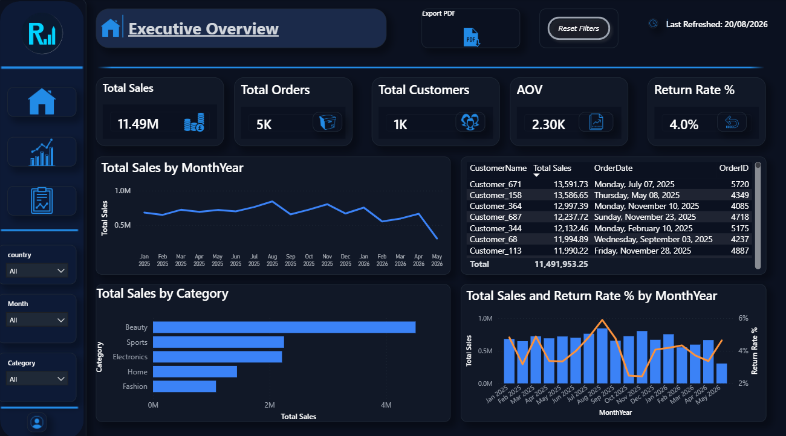
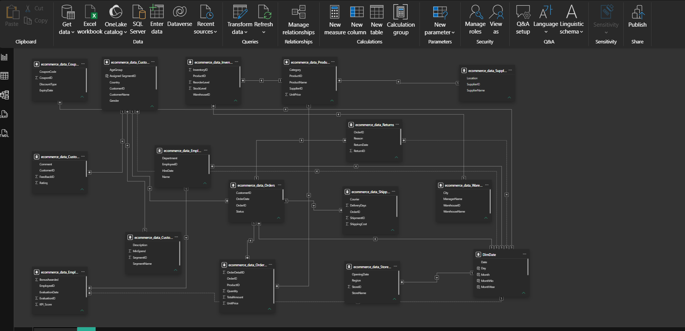

# OmniPulse Analytics Hub

A retail sales analytics dashboard built in Power BI, analyzing **$11.49M in sales** across **5,000 orders** and **1,000 customers** for a simulated e-commerce business. The project covers the full workflow: data modeling, DAX measures, and an executive-facing report.



## Watch the demo

(https://youtu.be/qgZpWxVNxmo)

_Video walkthrough covering filter interactions, drill-through, and both report pages._

## What this project does

The source data ships as 18 separate, unrelated CSV files (Customers, Orders, OrderDetails, Products, Returns, Employees, Inventory, and more) with no shared date table and several tables missing any foreign key at all. The core of this project is turning that into a working star-schema semantic model, then building an executive dashboard on top of it.

**Key modeling work:**

- Diagnosed and resolved circular / ambiguous relationship paths caused by bidirectional 1:1 relationships (Returns ↔ Orders, Shipping ↔ Orders)
- Replaced 7 separate auto-generated hidden date tables with a single shared `DimDate` calendar table, correctly handling multiple ambiguous filter paths to the same table
- Built a real (non-fabricated) relationship for the `CustomerSegments` table by deriving a customer's actual lifetime spend and assigning a segment tier using the table's own `MinSpend` thresholds — rather than inventing a fake key
- Documented and flagged 3 tables (`PaymentMethods`, `Promotions`, `MarketingChannels`) that genuinely cannot be linked without additional source data, instead of forcing an incorrect join

**Dashboard:**

- 2 report pages (Summary / Executive Overview and Sales Details) with cross-filtering slicers (country, month, category)
- Custom dark theme matching brand colors
- KPI cards, monthly trend, category breakdown, and a combo chart pairing sales against return rate

## Key insights surfaced

- **Beauty accounts for 39.2% of total revenue** ($4.51M) — the largest category by a wide margin, and also the highest average sales per SKU, representing both the strongest performer and the biggest concentration risk
- **Return rate averages 4.0%**, peaking at 5.9% in August 2025 — the same month as peak sales volume, suggesting fulfillment strain under load rather than a product quality issue
- **12 of Beauty's 15 SKUs are flagged low-stock** while it's simultaneously the top-selling category — the single largest stockout risk in the current inventory position
- **Damaged goods and late delivery together account for 43% of all returns** — both operationally controllable through packaging QA and carrier SLA review

## Tech stack

- **Power BI Desktop** — data modeling, report design
- **DAX** — 21 measures covering sales, returns, inventory, and customer segmentation
- **Power Query (M)** — source connections
- **Data modeling** — star schema design, relationship troubleshooting

## Data model



18 business tables (Customers, Orders, OrderDetails, Products, Inventory, Returns, Shipping, Suppliers, Warehouses, Employees, EmployeePerformance, CustomerFeedback, CustomerSegments, Coupons, StoreLocations, PaymentMethods, Promotions, MarketingChannels) plus a shared `DimDate` calendar table — 18 relationships total. Three tables (`PaymentMethods`, `Promotions`, `MarketingChannels`) remain intentionally unlinked: the source data has no key connecting them to the rest of the model, and forcing a join would silently corrupt any visual that touched them. See [`docs/dax-measures.md`](docs/dax-measures.md) for the full measure list with DAX definitions.

## Project structure

```
OmniPulse-Analytics-Hub/
├── OmniPulse_Analytics_Hub.pbix
├── data/                     18 source CSV files
├── docs/
│   ├── data-model-diagram.png
│   └── dax-measures.md
├── screenshots/
└── assets/
    └── logo.svg
```

## Author

Hazem Khaled — Data Analyst & BI Developer
[GitHub](https://github.com/Hazemkhaled278) · [LinkedIn](https://www.linkedin.com/in/hazem-mohamed-330bb027a/)
